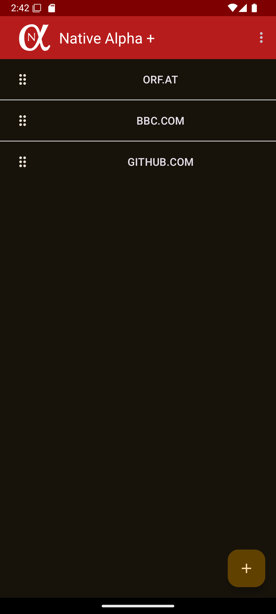
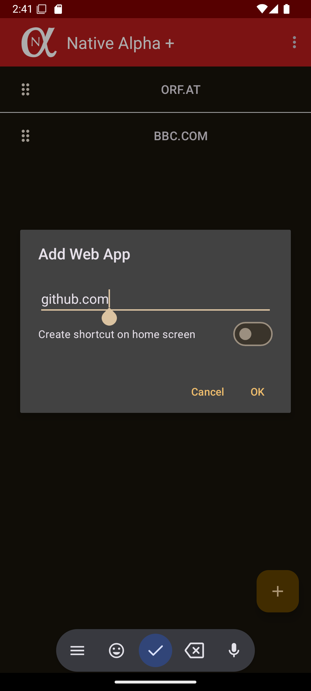
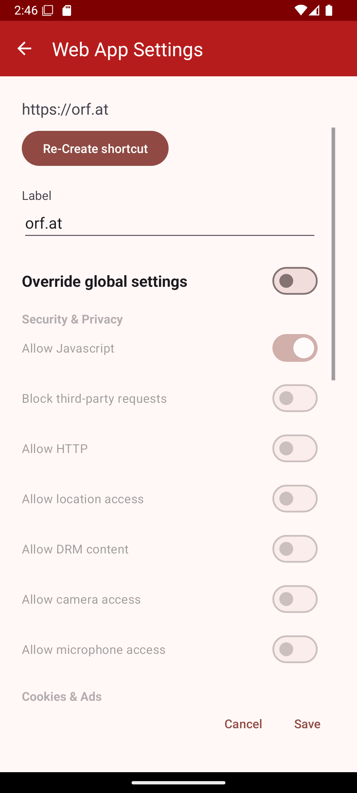
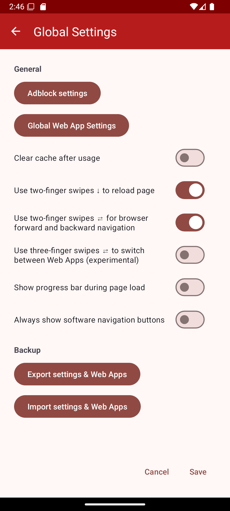

# </img> Native Alpha — Web App OS


[](https://github.com/cylonid/NativeAlphaForAndroid/releases)
[](https://somsubhra.github.io/github-release-stats/?username=cylonid&repository=NativeAlphaForAndroid&page=1&per_page=20)
[](https://www.gnu.org/licenses/gpl-3.0)


**Native Alpha** turns any website into a native-looking Android app using the Android System WebView — delivering a borderless, full-screen experience with no browser chrome. It has evolved into a full **Web App Operating System (WAOS)** with advanced session isolation, per-app sandboxing, automation, credential management, and more.

---

## Table of Contents

- [Features Overview](#features-overview)
- [Download](#download)
- [Build Variants / Flavors](#build-variants--flavors)
- [Architecture](#architecture)
- [Tech Stack](#tech-stack)
- [Building the Project](#building-the-project)
- [GitHub Actions CI](#github-actions-ci)
- [Feature Details](#feature-details)
- [FAQ](#faq)
- [Libraries Used](#libraries-used)
- [Screenshots](#screenshots)
- [Contributing](#contributing)
- [License](#license)

---

## Features Overview

### Core Web App Features
- **Borderless WebView launcher** — loads any URL in a full-screen, chrome-free window powered by Android System WebView
- **Home screen shortcuts** — creates launcher icons with auto-fetched high-resolution favicons
- **Per-app settings** — JavaScript, cookies, location, camera, microphone, and User-Agent can all be configured independently for each web app
- **Multi-touch gesture navigation** — swipe gestures for back/forward/reload
- **HTTP Auth support** — login dialogs for HTTP Basic Authentication
- **Custom User-Agent** — override the UA string per app
- **Periodic page refresh** — configure automatic reload intervals

### Session Isolation & Sandboxing
- **8 independent sandbox containers** — each web app can run in its own Android process (`web_sandbox_0` through `web_sandbox_7`), meaning zero shared state between sessions
- **Multiple simultaneous logins** — run two accounts of the same website side-by-side using separate sandboxes
- **Session Manager** — manages WebView session lifecycle and isolation state

### Ad Blocking
- **Built-in ad-block engine** (AdblockAndroid) — efficient filter-list-based blocking
- **Custom filter lists** — add your own blocklist URLs; the default is Fanboy's Ultimate List
- **Per-app opt-in** — enable or disable ad blocking independently for each web app

### Privacy & Security
- **Biometric access protection** — fingerprint + PIN fallback per web app
- **Credential Vault** — encrypted storage for per-site usernames and passwords
- **Force Dark Mode** — applies dark rendering to any website (configurable by time of day)
- **Clear cache on exit** — optional per-app cache clearing
- **Minimal permissions** — only requests permissions that specific features require

### WAOS Dashboard
- **Central multi-app hub** — view, launch, and manage all your web apps from one place
- **Smart folder grouping** — organise apps by category or domain
- **Card notification badges** — see at a glance which apps have new activity
- **Last-updated timestamps** — know when each app was last refreshed
- **Drag & drop reordering** — rearrange your app list with long-press and drag
- **Swipe actions** — swipe to delete or open per-app settings

### Automation Engine
- **Auto-click** — define CSS selectors or coordinates to be clicked automatically
- **Auto-scroll** — configure automatic scrolling behaviour per app
- **Custom JavaScript injection** — run arbitrary scripts on page load
- **Form-fill automation** — automate repetitive form inputs

### Floating Windows
- **Floating bubble launcher** — a persistent overlay bubble for quick app switching
- **Floating Window Manager** — run web apps in resizable overlay windows above other apps
- **Multi-window support** — view multiple web apps simultaneously

### Per-App Managers
- **Clipboard Manager** — isolated clipboard history per web app with swipe-to-delete
- **Download Manager** — per-app download tracking with search and filter, custom download folders
- **Universal File Viewer** — open images, video, audio, PDF, and text files in-app
- **Screenshot & Annotation** — capture and annotate screenshots from inside any web app

### Notifications & Background Tasks
- **Notification Manager** — per-app notification history and management
- **Background Refresh Worker** — periodically refresh web apps in the background using WorkManager
- **Screenshot Worker** — background scheduled screenshot capture

### Link Management
- **Link History Tracker** — per-app browsing history with timestamps
- **Link Suggestion Engine** — smart URL suggestions based on history
- **Link Management UI** — browse and manage link history in-app

### Backup & Restore
- **Full backup/restore** — export and import all web apps, settings, and session data

### UI & Accessibility
- **Material Design 3** — modern MD3 components and dynamic theming
- **Jetpack Compose screens** — settings, dashboard, file viewer, security, notifications, and more are built with Compose
- **Comprehensive accessibility support** — content descriptions and semantic markup throughout
- **Haptic feedback** — tactile responses on key interactions

---

## Download

| Store | Link |
|---|---|
| GitHub Release | [](https://github.com/cylonid/NativeAlphaForAndroid/releases/download/v1.5.2/NativeAlpha-extendedGithub-universal-release-v1.5.2.apk) |
| IzzyOnDroid (F-Droid) | [](https://apt.izzysoft.de/fdroid/index/apk/com.cylonid.nativealpha) |
| Google Play (Free) | [](https://play.google.com/store/apps/details?id=com.cylonid.nativealpha) |
| Google Play (Pro) | [](https://play.google.com/store/apps/details?id=com.cylonid.nativealpha.pro) |

[](https://liberapay.com/cylonid/donate)

> **Note (v1.5.0+):** The GitHub and IzzyOnDroid release is functionally equivalent to Native Alpha Plus (all pro features included).

---

## Build Variants / Flavors

The project defines three product flavors:

| Flavor | App ID | App Name | Notes |
|---|---|---|---|
| `standard` | `com.cylonid.nativealpha` | Native Alpha | Default; distributed via F-Droid and direct APK |
| `extendedGithub` | `com.cylonid.nativealpha` | Native Alpha | GitHub release; includes all Pro features |
| `extended` | `com.cylonid.nativealpha.pro` | Native Alpha + | Google Play Pro build |

Each flavor is also built with `debug` and `release` build types, producing APK splits for `armeabi-v7a`, `x86`, `arm64-v8a`, `x86_64`, and a universal APK.

---

## Architecture

Native Alpha uses a layered architecture combining a legacy View-based layer with a modern WAOS layer:

```
app/src/main/
├── java/com/cylonid/nativealpha/   ← Legacy Java/Kotlin (Activities, DataManager)
│   ├── MainActivity.kt
│   ├── WebViewActivity.java         ← Template; auto-cloned into 8 sandboxed copies at build time
│   ├── WebAppSettingsActivity.kt
│   ├── SettingsActivity.kt
│   ├── model/                       ← WebApp data model, DataManager
│   ├── util/                        ← Utility helpers
│   └── waos/                        ← WAOS service/UI layer (legacy)
│       ├── model/
│       ├── serviceui/
│       └── util/
│
└── kotlin/com/cylonid/nativealpha/  ← Modern Kotlin + Compose + Hilt layer
    ├── activities/                  ← AdblockConfigActivity, NewsActivity
    ├── automation/                  ← WebAutomationEngine
    ├── clipboard/                   ← EnhancedClipboardManager
    ├── credentials/                 ← EnhancedCredentialKeeper
    ├── data/                        ← Room database, DAOs, Repositories
    ├── di/                          ← Hilt AppModule
    ├── downloads/                   ← EnhancedDownloadManager
    ├── fileviewer/                  ← UniversalFileViewerComposable
    ├── fragments/                   ← AdblockList, WebAppList fragments
    ├── helper/                      ← Biometric, Adblock, Icon helpers
    ├── links/                       ← LinkManagementSystem, LinkHistoryTracker
    ├── manager/                     ← Clipboard/Credential/Download managers
    ├── ui/screens/                  ← Jetpack Compose screens
    ├── ui/theme/                    ← MD3 Color, Theme, Typography
    ├── util/                        ← Extensions and utilities
    ├── viewmodel/                   ← ViewModels for all features
    ├── webview/                     ← SessionManager, ChromeClient, JSInterface
    └── worker/                      ← RefreshWorker, ScreenshotWorker
```

### Sandbox Generation (Build-Time)

At build time, Gradle automatically:
1. Generates 8 copies of `WebViewActivity.java` named `__WebViewActivity_0` through `__WebViewActivity_7`
2. Injects 8 corresponding `<activity>` entries into `AndroidManifest.xml`, each running in its own process (`web_sandbox_0` … `web_sandbox_7`)
3. Cleans up the generated files after the build completes

This gives each sandboxed web app a fully isolated OS process with no shared WebView state.

---

## Tech Stack

| Layer | Technology |
|---|---|
| Language | Kotlin 2.1.20 (+ legacy Java) |
| UI | Jetpack Compose (Material Design 3) + XML Views |
| Architecture | MVVM + Hilt (Dependency Injection) |
| Database | Room 2.7.0 |
| Async | Kotlin Coroutines + Flow |
| Background Work | WorkManager |
| WebView | Android System WebView (androidx.webkit 1.13.0) |
| Ad Blocking | AdblockAndroid v0.9.1 |
| Icon Parsing | Jsoup 1.14.1 |
| Biometric | Androidx Biometric 1.1.0 |
| Navigation | Androidx Navigation 2.8.9 |
| PDF Viewing | AndroidPdfViewer 3.1.0-beta.1 |
| Build System | Gradle 8.8.2 / Android Gradle Plugin 8.8.2 |
| Min SDK | 28 (Android 9) |
| Target SDK | 35 (Android 15) |

---

## Building the Project

### Prerequisites

- **JDK 17** (recommended: Eclipse Temurin / OpenJDK 17)
- **Android SDK** with build-tools for API 35
- **Android Studio Ladybug** or newer (optional but recommended)

### Clone & Build

```bash
git clone https://github.com/cylonid/NativeAlphaForAndroid.git
cd NativeAlphaForAndroid

# Build the standard debug APK
./gradlew assembleStandardDebug

# Build the GitHub extended (Pro) release APK
./gradlew assembleExtendedGithubRelease

# Build all variants
./gradlew assemble
```

### Signing a Release Build

To sign a release APK, create a `keystore.properties` file in the project root (do **not** commit this file) or configure signing via environment variables in your CI pipeline.

### Known Build Notes

- The build script auto-generates `__WebViewActivity_0..7` Java files and a modified `AndroidManifest.xml` before compilation. These are cleaned up automatically after the build.
- If you see the manifest in a modified state after a failed build, run:
  ```bash
  ./gradlew renameManifest
  ```
  to restore the original `AndroidManifest.xml`.

---

## GitHub Actions CI

The project includes a CI workflow at `.github/workflows/debug-apk.yml` that automatically builds a **Standard Debug APK** on every push to `main`, `master`, `develop`, or `dev`, and on all pull requests.

### What the CI does

1. Checks out the repository
2. Sets up JDK 17 (Temurin) and the Android SDK
3. Caches Gradle dependencies for faster builds
4. Runs `./gradlew assembleStandardDebug`
5. Uploads the resulting APK as a GitHub Actions artifact (retained 30 days)
6. On failure, uploads build reports for diagnosis
7. On a tagged release, creates a GitHub pre-release with the debug APK attached

### Triggering a Build

Push to any of the watched branches, open a pull request, or trigger manually via the **Actions → Build Debug APK → Run workflow** button in the GitHub UI.

---

## Feature Details

### Adblock Configuration

1. Open the main menu → **Adblock Settings**
2. Add or remove filter list URLs
3. The app downloads and applies filter lists in the background
4. Default list: [Fanboy's Ultimate List](https://fanboy.co.nz)

### Sandbox Isolation

- Enable **Sandbox** on a per-app basis in the web app settings
- Each sandboxed app runs in a separate OS process with a separate WebView data directory
- Up to 8 sandboxed apps can be active simultaneously

### Biometric Protection

- Enable **Biometric Lock** per app in settings
- On launch, the app prompts for fingerprint (with PIN fallback)
- Managed by `BiometricPromptHelper` and `SecurityRepository`

### Credential Vault

- Store credentials per web app via the Credential Vault screen
- Credentials are encrypted and isolated per app
- Managed by `EnhancedCredentialKeeper` and `CredentialViewModel`

### Web Automation

- Available via per-app settings → **Automation**
- Supports auto-click (CSS selector or coordinates), auto-scroll, and custom JS injection
- Managed by `WebAutomationEngine`

### Floating Windows

- Requires the **Display over other apps** permission
- Launch the floating bubble from the WAOS Dashboard
- Managed by `FloatingWindowManagerScreen` and `FloatingWindowViewModel`

### Universal File Viewer

- Triggered when a download is intercepted
- Supports: images, video, audio, PDF, plain text
- Uses `UniversalFileViewerComposable` and `FileViewerViewModel`

---

## FAQ

<details>
<summary><b>Why would I need this app if any browser can create shortcuts?</b></summary>

Mobile browsers only deliver a native, borderless full-screen shortcut if the website has a PWA manifest. Most websites do not. Native Alpha works for every URL. It also lets you configure different settings (JS, cookies, UA, adblock) for each web app independently — something no browser supports.
</details>

<details>
<summary><b>Can I maintain multiple logins of the same website at the same time?</b></summary>

Yes. Enable the **Sandbox** option on two separate entries for the same URL. Each sandboxed entry runs in an isolated OS process, so sessions are completely separate.
</details>

<details>
<summary><b>Does this app include its own browser engine?</b></summary>

No. It relies on the **Android System WebView** that is already installed on your device. For privacy-conscious users on rooted devices, alternative WebViews such as [Bromite](https://www.bromite.org/system_web_view) can be used.
</details>

<details>
<summary><b>Why can't an icon be found for a certain website?</b></summary>

The website likely does not provide a high-resolution favicon. If you maintain a website, use [RealFaviconGenerator](https://realfavicongenerator.net) to ensure compatible icons. You can also set a custom icon manually.
</details>

<details>
<summary><b>The app uses a lot of storage. Why?</b></summary>

Native Alpha caches web content just like any browser to speed up repeated visits. Enable **Clear cache after usage** in global settings to limit storage use (at the cost of slower load times).
</details>

<details>
<summary><b>What is the minimum Android version?</b></summary>

Android 9 (API 28) and above.
</details>

<details>
<summary><b>How can I get Native Alpha Plus without Google Play?</b></summary>

The GitHub release and the IzzyOnDroid (F-Droid compatible) release are fully equivalent to Native Alpha Plus — all pro features are included. You can also build the app yourself; everything is open-source.
</details>

<details>
<summary><b>Why does the sandbox feature increase disk usage?</b></summary>

Each sandbox container maintains its own isolated WebView data directory (cookies, cache, local storage). Use sandbox mode selectively for sites where session isolation matters, not for every web app.
</details>

---

## Libraries Used

| Library | Purpose |
|---|---|
| [AdblockAndroid](https://github.com/Edsuns/AdblockAndroid) | Filter-list-based ad blocking engine |
| [Jsoup](https://jsoup.org/) | HTML parsing for favicon and metadata extraction |
| [CircularProgressBar](https://github.com/lopspower/CircularProgressBar) | Circular loading indicator |
| [Android About Page](https://github.com/medyo/android-about-page) | About screen |
| [AboutLibraries](https://github.com/mikepenz/AboutLibraries) | Open-source library attribution list |
| [Drag Drop Swipe RecyclerView](https://github.com/ernestoyaquello/DragDropSwipeRecyclerview) | Drag & drop and swipe gestures in lists |
| [AndroidPdfViewer](https://github.com/barteksc/AndroidPdfViewer) | In-app PDF rendering |
| [Process Phoenix](https://github.com/JakeWharton/ProcessPhoenix) | Process restart for sandbox isolation |
| [Hilt](https://dagger.dev/hilt/) | Dependency injection |
| [Room](https://developer.android.com/training/data-storage/room) | Local database (credentials, clipboard, downloads, links) |
| [Jetpack Compose](https://developer.android.com/jetpack/compose) | Modern declarative UI |
| [WorkManager](https://developer.android.com/topic/libraries/architecture/workmanager) | Background refresh and screenshot tasks |
| [Biometric](https://developer.android.com/jetpack/androidx/releases/biometric) | Fingerprint / PIN access protection |
| [EasyPermissions](https://github.com/googlesamples/easypermissions) | Runtime permission handling |
| [Robolectric](https://github.com/robolectric/robolectric) | Unit testing with Android framework |
| [Espresso](https://developer.android.com/training/testing/espresso/) | UI instrumentation testing |

A full list of open-source libraries is also available inside the app under **About**.

---

## Screenshots

<details>
<summary>Click to expand screenshots</summary>

<div style="text-align:center">




</div>
</details>

---

## Contributing

Contributions are welcome! Please:

1. Fork the repository
2. Create a feature branch (`git checkout -b feature/my-feature`)
3. Build and test locally with `./gradlew assembleStandardDebug`
4. Open a pull request against `main`

Please make sure the GitHub Actions CI build passes before requesting a review.

---

## License

Native Alpha is Free Software licensed under the **GNU General Public License v3.0 or later**.

You can use, study, share, and improve it. See the [LICENSE](LICENSE) file for the full text.

---

## Disclaimer

THIS SOFTWARE IS PROVIDED BY THE AUTHOR "AS IS" AND ANY EXPRESS OR IMPLIED WARRANTIES, INCLUDING, BUT NOT LIMITED TO, THE IMPLIED WARRANTIES OF MERCHANTABILITY AND FITNESS FOR A PARTICULAR PURPOSE ARE DISCLAIMED. IN NO EVENT SHALL THE AUTHOR BE LIABLE FOR ANY DIRECT, INDIRECT, INCIDENTAL, SPECIAL, EXEMPLARY, OR CONSEQUENTIAL DAMAGES (INCLUDING, BUT NOT LIMITED TO, PROCUREMENT OF SUBSTITUTE GOODS OR SERVICES; LOSS OF USE, DATA, OR PROFITS; OR BUSINESS INTERRUPTION) HOWEVER CAUSED AND ON ANY THEORY OF LIABILITY, WHETHER IN CONTRACT, STRICT LIABILITY, OR TORT (INCLUDING NEGLIGENCE OR OTHERWISE) ARISING IN ANY WAY OUT OF THE USE OF THIS SOFTWARE, EVEN IF ADVISED OF THE POSSIBILITY OF SUCH DAMAGE.
